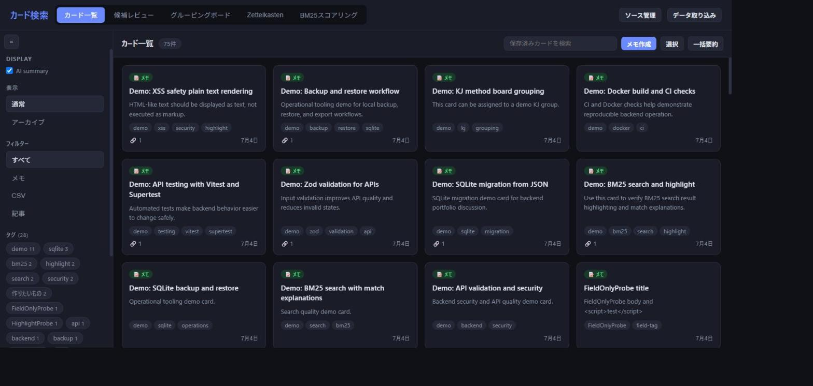
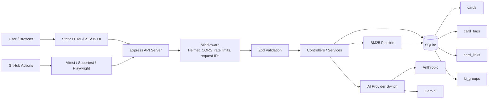
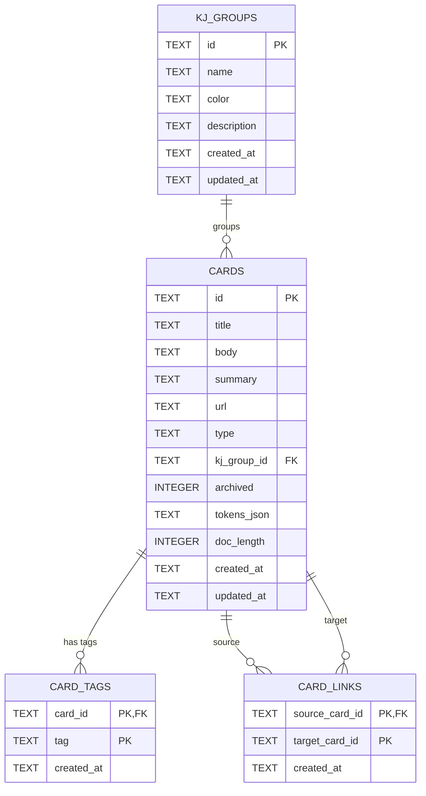

# My Search App

[Japanese README](README_ja.md)

## 概要
My Search App is a local-first knowledge management app built around BM25 search, SQLite persistence, normalized card relations, and backend quality practices.

It supports card-style notes, tags, backlinks, KJ grouping, CSV/JSON import, Markdown export, and AI summaries while keeping data local by default.

## Stable Portfolio Version

This repository is treated as a stable portfolio version of the local-first knowledge management app. Future work is tracked as incremental improvements rather than required functionality for the current version. The current focus is local knowledge management, BM25 search, SQLite persistence, and backend quality through tests, CI, benchmarks, and documentation.

Details:

- [API examples](docs/api.md)
- [Logging and error observability](docs/logging.md)
- [E2E tests](docs/e2e.md)
- [Full test coverage](docs/test-coverage.md)
- [Project details, setup, DB design, and operations](docs/project-details.md)
- [Design decisions](docs/design-decisions.md)
- [License](LICENSE): MIT

## デモ

https://github.com/user-attachments/assets/be5052d8-1d60-4aaa-8f6a-565dbaa1ee4d

## 特徴

- BM25 search over card title, body, summary, tags, and related metadata
- SQLite persistence with normalized `card_tags` and `card_links` junction tables
- Collected articles are persisted in SQLite with URL de-duplication and token caches
- Card CRUD, archive/restore, bulk archive/delete, and Markdown export
- Zettelkasten-style links, backlinks, and graph view
- KJ group organization backed by SQLite
- CSV/JSON import with validation
- AI summaries via Anthropic or Gemini, with mock mode for local tests
- Structured JSON logging with request IDs
- Vitest / Supertest / Playwright coverage, plus GitHub Actions CI

## Core Workflow

My Search App keeps collection and saved knowledge as separate lifecycles:

`Collect -> BM25 rank -> Review -> Save as Card -> Organize -> Search saved knowledge -> Export`

Collected candidates expose `unreviewed`, `reviewed_not_saved`, `saved_as_card`, and `expired` states through the candidate API. BM25 ranks collected articles before saving; `GET /api/cards?q=...` is intentionally a lightweight SQLite `LIKE` filter for already-saved cards, not a second BM25 pipeline.

The candidate lifecycle is local-only and stored in SQLite. Saving a candidate creates a normal article card and marks the source candidate as `saved_as_card`; candidate expiry never archives or deletes a saved card.
## Architecture

More architecture notes are in [docs/project-details.md](docs/project-details.md).

## Benchmark

Benchmark numbers are generated, not hand-maintained. Run `npm run benchmark` for ranking-only, production-like, end-to-end pipeline, first-pipeline-call, repeated-pipeline-call, and candidate near-duplicate/diverse scopes. Run `npm run benchmark:http` for independent HTTP measurements.

Latest benchmark snapshot (2026-08-12, `resultLimit=100`):

| Scope | Corpus | Deduplication | Elapsed | Threshold | Result |
|---|---:|---|---:|---:|---|
| ranking-only | 10,000 | disabled | 129.333 ms | 500 ms | pass |
| production-like | 5,000 | enabled | 2,821.705 ms | 3,000 ms | pass |
| end-to-end-pipeline | 1,000 | disabled | 18.978 ms | 1,000 ms | pass |
| first-pipeline-call | 100 | disabled | 3.682 ms | 1,000 ms | pass |
| repeated-pipeline-call | 100 | disabled | 3.704 ms | 100 ms | pass |

The complete generated output is recorded in `artifacts/benchmark-results.json` and `docs/benchmark.md`. Regenerate this snapshot with `npm run benchmark` after performance changes.

Latest generated artifacts:

- artifacts/benchmark-results.json
- artifacts/benchmark-http-results.json
- artifacts/search-quality.json

The current search-quality dataset is version `v5-57-docs-20-query-cases` with 57 English/Japanese documents and 20 labeled cases. Ranking-only and end-to-end query evaluation are reported separately in `artifacts/ranking-engine-quality.json` and `artifacts/end-to-end-query-quality.json`; the aggregate artifact is `artifacts/search-quality.json`. The current gate is ranking/end-to-end P@1 >= 0.75 and MRR >= 0.80.

See docs/benchmark.md, docs/search-quality.md, and docs/demo-15min.md for reproducible details.
## Technology Stack

| Area | Technologies |
|---|---|
| Backend | Node.js, TypeScript, Express |
| Database | SQLite, better-sqlite3 |
| Search | BM25, persisted token data |
| Validation / Security | Zod, Helmet, CORS, express-rate-limit |
| Testing | Vitest, Supertest, Playwright |
| DevOps | Docker, Docker Compose, GitHub Actions |
| Frontend | HTML, CSS, JavaScript |
| AI | Anthropic API, Gemini API |

## Current Limitations

- Single-user local app; production authentication and multi-device sync are not included.
- Collectors depend on external RSS, arXiv, and GitHub sources.
- AI summaries are optional and require a configured provider key.
- Candidate quality evaluation uses a deterministic local dataset; large-scale deduplication and vector search are future work.
- No cloud deployment, PostgreSQL, Elasticsearch, or mobile app is included.
