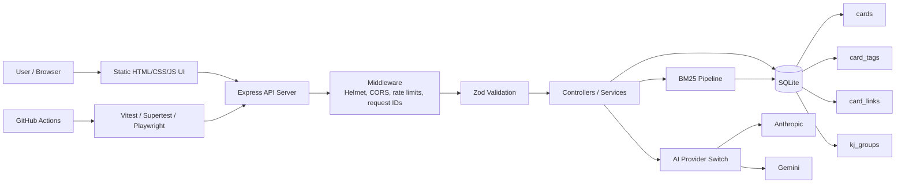
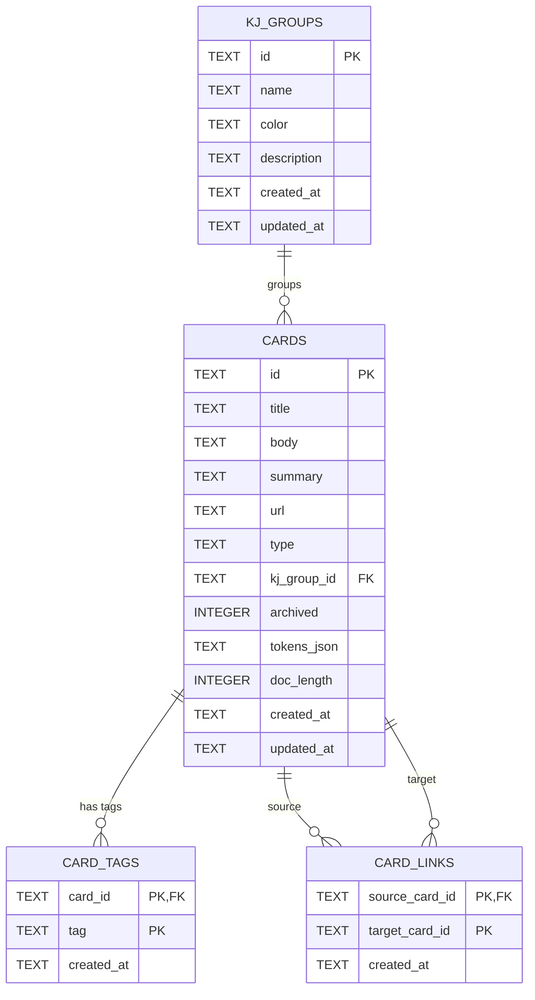

# My Search App

## 概要
My Search App is a local-first knowledge management app built around BM25 search, SQLite persistence, normalized card relations, and backend quality practices.

It supports card-style notes, tags, backlinks, KJ grouping, CSV/JSON import, Markdown export, and AI summaries while keeping data local by default.

Details:

- [API examples](docs/api.md)
- [Logging and error observability](docs/logging.md)
- [E2E tests](docs/e2e.md)
- [Full test coverage](docs/test-coverage.md)
- [Project details, setup, DB design, and operations](docs/project-details.md)
- [Design decisions](docs/design-decisions.md)
- [License](LICENSE): MIT

## デモ

https://github.com/user-attachments/assets/be5052d8-1d60-4aaa-8f6a-565dbaa1ee4d

## 特徴

- BM25 search over card title, body, summary, tags, and related metadata
- SQLite persistence with normalized `card_tags` and `card_links` junction tables
- Collected articles are persisted in SQLite with URL de-duplication and token caches
- Card CRUD, archive/restore, bulk archive/delete, and Markdown export
- Zettelkasten-style links, backlinks, and graph view
- KJ group organization backed by SQLite
- CSV/JSON import with validation
- AI summaries via Anthropic or Gemini, with mock mode for local tests
- Structured JSON logging with request IDs
- Vitest / Supertest / Playwright coverage, plus GitHub Actions CI

## Architecture

More architecture notes are in [docs/project-details.md](docs/project-details.md).

## Benchmark

The BM25 pipeline was improved by moving tokenization out of the search hot path. Cards now store precomputed `tokens_json` and `doc_length` when saved.

| Stage | Before | After |
|---|---:|---:|
| Load cards | 2.175 ms | 7.054 ms |
| Tokenize | 4.584 s | 0.464 ms |
| Score | 4.705 s | 40.778 ms |
| Total BM25 | 9.705 s | 1.413 s |

The largest gain came from removing per-search morphological tokenization. Remaining bottlenecks are likely DB access, aggregation, and sorting.

There are two benchmark scopes:

- End-to-end local app measurement: measures the actual application path and includes additional application overhead.
- Isolated BM25 benchmark: measures the benchmark script path with deterministic synthetic corpora and precomputed token data.

| Measurement | Scope | Result |
|---|---|---:|
| End-to-end local app path | Actual app path | 1.413 s |
| Isolated BM25 benchmark | 10,000 synthetic cards | 120.708 ms |

For reproducible corpus-size benchmarks, see [docs/benchmark.md](docs/benchmark.md).

For search quality evaluation, see [docs/search-quality.md](docs/search-quality.md).

## Technology Stack

| Area | Technologies |
|---|---|
| Backend | Node.js, TypeScript, Express |
| Database | SQLite, better-sqlite3 |
| Search | BM25, persisted token data |
| Validation / Security | Zod, Helmet, CORS, express-rate-limit |
| Testing | Vitest, Supertest, Playwright |
| DevOps | Docker, Docker Compose, GitHub Actions |
| Frontend | HTML, CSS, JavaScript |
| AI | Anthropic API, Gemini API |
