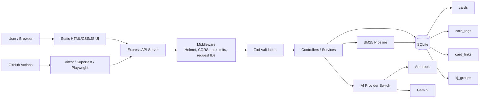

# My Search App

[English README](README.md)

## 概要

My Search App は、ローカルファーストの知識管理アプリです。カード型メモを中心に、BM25検索、SQLite永続化、タグ、Zettelkastenリンク、KJグループ、CSV/JSON import、Markdown export、AI要約を備えています。

このリポジトリは、単なるメモアプリではなく、検索・DB設計・API設計・テスト・CI・ベンチマークを説明できるポートフォリオとして整えています。

## Stable Portfolio Version

このリポジトリは、local-first knowledge management app としての安定版ポートフォリオです。現在の目的は、ローカル環境での知識管理、BM25検索、SQLite永続化、テスト・CI・ベンチマークを含むバックエンド品質を示すことです。

今後の改善は、現在版に必須の機能ではなく、段階的な Future Improvements として扱います。

詳細ドキュメント:

- [API例](docs/api_ja.md)
- [ログとエラー可観測性](docs/logging_ja.md)
- [E2Eテスト](docs/e2e_ja.md)
- [テストカバレッジ](docs/test-coverage_ja.md)
- [プロジェクト詳細・DB設計・運用](docs/project-details_ja.md)
- [設計判断](docs/design-decisions_ja.md)
- [ベンチマーク](docs/benchmark_ja.md)
- [検索品質評価](docs/search-quality_ja.md)
- [License](LICENSE): MIT

## デモ

https://github.com/user-attachments/assets/be5052d8-1d60-4aaa-8f6a-565dbaa1ee4d

## 中心ワークフロー

`収集 -> BM25で順位付け -> レビュー -> カード保存 -> 整理 -> 保存知識の検索 -> Export`

収集記事と保存済みカードは別のライフサイクルで管理します。候補には `unreviewed`、`reviewed_not_saved`、`saved_as_card`、`expired` の状態があり、候補の期限切れは保存済みカードをアーカイブ・削除しません。`POST /api/run` は収集候補のBM25検索、`GET /api/cards?q=...` は保存済みカードのSQLite `LIKE` フィルターです。
## 特徴

- カードのタイトル・本文・要約・タグを対象にしたBM25検索
- SQLiteによるローカル永続化
- `card_tags` / `card_links` による正規化された関係管理
- 収集記事のSQLite保存、URL重複排除、トークンキャッシュ
- カードCRUD、アーカイブ/復元、一括操作、Markdown export
- Zettelkastenリンク、バックリンク、ネットワーク表示
- SQLite backed のKJグループ
- CSV/JSON import とZod validation
- Anthropic / Gemini によるAI要約、テスト用mock mode
- Pino構造化ログ、request ID、rate limit
- Vitest / Supertest / Playwright によるテスト
- Docker / Docker Compose / GitHub Actions CI

## Architecture

詳しい設計は [docs/project-details_ja.md](docs/project-details_ja.md) を参照してください。

## Benchmark

BM25検索は、検索時に毎回トークン化する方式から、保存時に `tokens_json` と `doc_length` を事前計算してSQLiteに保存する方式へ改善しました。

| Stage | Before | After |
|---|---:|---:|
| Load cards | 2.175 ms | 7.054 ms |
| Tokenize | 4.584 s | 0.464 ms |
| Score | 4.705 s | 40.778 ms |
| Total BM25 | 9.705 s | 1.413 s |

最大の改善は、検索ごとの形態素解析をなくしたことです。残るボトルネック候補は、DBアクセス、集計、ソートです。

ベンチマークは ranking-only、production-like、end-to-end API、cold-start、warm-search の条件を分けて測定します。[docs/benchmark_ja.md](docs/benchmark_ja.md) を参照してください。検索品質評価は40文書・15クエリ（日本語/英語）で実施し、[docs/search-quality_ja.md](docs/search-quality_ja.md) にまとめています。

## 技術スタック

| 領域 | 技術 |
|---|---|
| Backend | Node.js, TypeScript, Express |
| Database | SQLite, better-sqlite3 |
| Search | BM25, persisted token data |
| Validation / Security | Zod, Helmet, CORS, express-rate-limit |
| Testing | Vitest, Supertest, Playwright |
| DevOps | Docker, Docker Compose, GitHub Actions |
| Frontend | HTML, CSS, JavaScript |
| AI | Anthropic API, Gemini API |

## 現在の制約

- 単一ユーザー向けのローカルアプリであり、本番認証と複数端末同期は対象外です。
- 収集処理はRSS、arXiv、GitHubなど外部ソースに依存します。
- AI要約は任意機能で、利用にはプロバイダーのAPIキーが必要です。
- 大規模な重複排除、ベクトル検索、クラウド展開、PostgreSQL、Elasticsearch、モバイルアプリは対象外です。

### 最新検証結果

ベンチマークと検索品質評価の値は手書き固定値ではなく、検証時にJSON成果物として生成します。

- artifacts/benchmark-results.json
- artifacts/benchmark-http-results.json
- artifacts/search-quality.json
- 検索品質dataset: v2-50-docs-20-queries
- 50文書、20クエリ、英語・日本語
- P@1 0.85以上、MRR 0.90以上、Recall@5 0.90以上、nDCG@5 0.85以上をCI Gateとする
- 最新の検索品質ゲート結果: P@1 0.95、MRR 0.95、Recall@5 0.95、nDCG@5 0.95（`artifacts/search-quality.json`）
