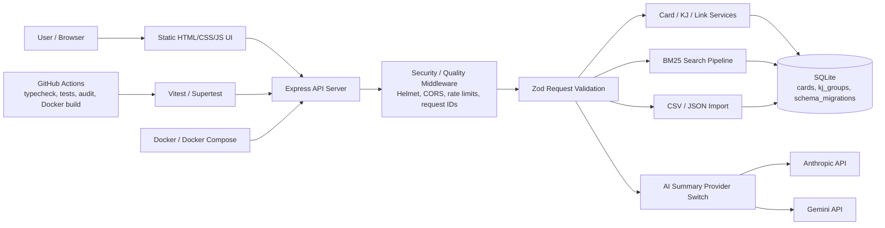
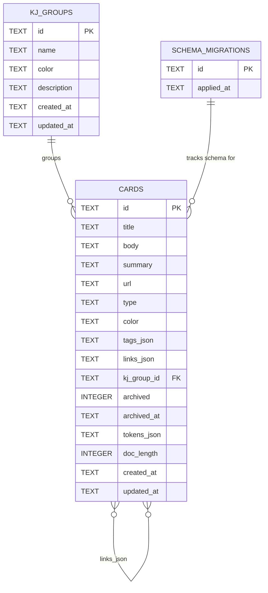
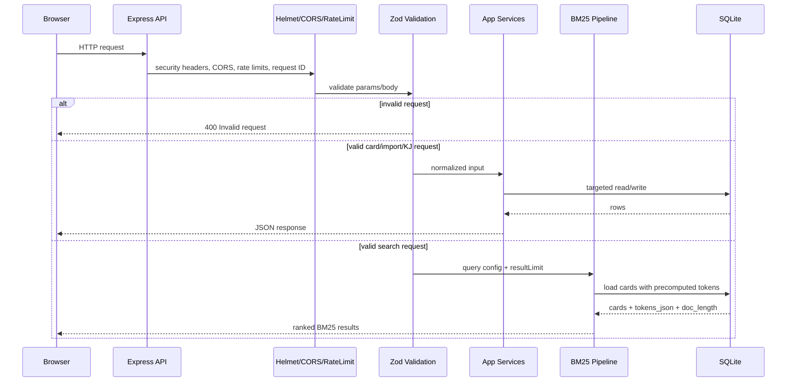

# My Search App

[](https://github.com/jinghaodao-tech/my-search_public/actions/workflows/ci.yml)

## デモ

https://github.com/user-attachments/assets/be5052d8-1d60-4aaa-8f6a-565dbaa1ee4d

My Search App は、BM25検索、SQLiteによる永続化、そしてポートフォリオとして評価されるバックエンド品質を軸にした、ローカルファーストの知識管理アプリです。カード型メモ、タグ、バックリンク、KJ法によるグループ化、CSV/JSONインポート、AI要約を備えつつ、データはデフォルトでローカルに保持します。

このプロジェクトでは、JSONファイルからSQLiteへの移行、検索高速化のためのBM25トークンデータの永続化、ZodによるAPIバリデーション、Vitest / Supertestによるエンドポイントテスト、DockerとCIによる再現可能な運用など、実践的なエンジニアリング改善を示しています。

## 機能

- カード型メモの作成、編集、削除、アーカイブ、復元
- BM25スコアリングによるカード検索
- タグによるカード整理
- 双方向リンクとバックリンクによる関連カードの接続
- KJ法風ボードによるカードのグループ化
- CSV / JSONからのカードインポート
- 可搬性とバックアップのための個別カードMarkdownエクスポート
- AnthropicまたはGeminiによるAI要約生成
- ローカル実行またはDocker Composeによる実行
- GitHub Actionsでの型チェック、APIテスト、高 severity の依存関係監査

## 技術スタック

| 領域 | 技術 |
|---|---|
| Backend | Node.js, TypeScript, Express |
| Database | SQLite, better-sqlite3 |
| Search | BM25, 永続化されたトークンデータ |
| Validation / Security | Zod, Helmet, CORS, express-rate-limit |
| Testing | Vitest, Supertest |
| DevOps | Docker, Docker Compose, GitHub Actions |
| Frontend | HTML, CSS, JavaScript |
| AI | Anthropic API, Gemini API |

## アーキテクチャ図

### システムアーキテクチャ



### ER図



### APIフロー



## プロジェクト背景

初期バージョンでは、カードデータをJSONファイルに保存していました。この方式はシンプルでしたが、データ量が増えるにつれて、ファイル全体の読み込みや一括更新のコストが大きくなりました。そこで、既存のカードCRUDの挙動を維持したまま、保存層をSQLiteへ移行しました。

検索はBM25で実装しています。検索リクエストごとにカード本文をトークン化するのではなく、カード保存時にトークンデータと文書長を生成し、SQLiteに永続化しています。これにより、検索時に繰り返し発生する前処理を削減しています。

### BM25パフォーマンス改善前 / 改善後

検索パイプラインは、検索ごとに全カードをトークン化する方式から、カード保存時に `tokens_json` と `doc_length` を事前計算する方式へ変更しました。これらの事前計算値はSQLiteに保存され、BM25スコアリング時に再利用されます。

| Stage | Before | After |
|---|---:|---:|
| Load cards | 2.175 ms | 7.054 ms |
| Tokenize | 4.584 s | 0.464 ms |
| Score | 4.705 s | 40.778 ms |
| Total BM25 | 9.705 s | 1.413 s |

最大の改善は、検索処理のホットパスから毎回の形態素解析によるトークン化を取り除いたことによるものです。BM25全体ではまだ1.413秒かかっているため、次のボトルネック候補はデータベースアクセス、集計、ソート処理だと考えられます。

APIも、バックエンドポートフォリオとしての品質を高めるために改善しました。カード作成/更新、一括操作、インポート、リンク、AI要約、KJグループ、collect、scheduler、BM25実行APIでは、アプリケーションロジックを実行する前にリクエストボディを検証しています。また、Expressアプリをサーバー起動処理から分離してexportすることで、SupertestからAPIを直接テストできるようにしています。

## セキュリティとAPI品質

このプロジェクトでは、主要なAPI経路に対して、リクエストバリデーション、レート制限、セキュリティヘッダー、CIチェックを追加しています。これらは、あらゆるシナリオに対して完全なセキュリティを保証するためのものではありません。重要度が高くリスクのあるエンドポイントに対して、実践的なバックエンド品質改善を示すことを目的としています。

- **Zod validation**: カード作成/更新、一括操作、インポート、リンク、AI要約、KJグループ、collect、scheduler、BM25実行APIでは、アプリケーションロジック実行前にZodでリクエストボディを検証します。不正な型、空文字、過大な入力、不正なURL、想定外のフィールド、不正なIDリストはAPI層で拒否されます。
- **Helmet**: Helmetを用いて、一般的なHTTPセキュリティヘッダーを設定しています。
- **CORS**: CORSは完全開放としてハードコードしていません。許可するオリジンは `CORS_ORIGIN` で設定できます。
- **Rate limiting**: AI要約やインポート関連APIにはレート制限を設け、濫用、過剰負荷、外部APIコストのリスクを抑えています。
- **Error handling**: バリデーションエラーは `{ "error": "Invalid request", "details": ... }` 形式の一貫した `400` レスポンスを返します。
- **Dependency audit**: CIで `npm audit --audit-level=high` を実行し、npm依存関係に既知の高 severity 脆弱性がないか検出します。
- **Testing**: APIテストでは、正常系と不正リクエストの両方をカバーしています。
- **DB path**: `DB_PATH` により、ローカル環境とDocker環境で異なるデータベースパスを使えます。

つまり、このプロジェクトはすべてのAPIが完全に保護されていると主張するものではありません。主要なAPI経路に対して、バリデーション、セキュリティヘッダー、レート制限、テスト、CIチェックを追加して改善していることを示しています。

## CI / Testing

GitHub Actionsは、`main` へのpushおよびpull request時に以下のコマンドを実行します。

```bash
npm ci
npm run typecheck
npm test
npm audit --audit-level=high
docker build -t my-search-public:test .
```

現在のAPIテストスイートでは、以下をカバーしています。

- カード作成の成功
- 空タイトルおよび過大な本文に対するバリデーションエラー
- 存在しないカードIDに対する `404`
- 不正な一括操作ペイロード
- 自己リンクの拒否
- 不正なCSV / JSONインポートリクエスト
- インポート関連APIのレート制限
- カード更新、一括アーカイブ/復元/削除、双方向リンク削除などのデータベース書き込み経路

## 運用

このプロジェクトには、ローカルファースト開発とポートフォリオデモのための小さな運用スクリプトが含まれています。ローカルファーストアプリで使用するSQLiteデータベースをコピー・復元するために、CLIベースのローカルバックアップ/復元スクリプトを用意しています。

```bash
npm run seed:demo
npm run export:json
npm run export:sqlite
npm run backup
npm run restore -- backups/cards-YYYY-MM-DDTHH-MM-SS-000Z.db
npm run db:migrate
npm run migrate:kj-groups
npm run benchmark
```

サーバーは、軽量なアプリケーションおよびSQLiteのヘルスチェックとして `GET /healthz` も公開しています。また、リクエストログは `X-Request-Id` 付きのJSONとして出力されるため、DockerやCIログ上でフィルタしやすくなっています。このプロジェクトには、ローカル開発と将来のスキーマ変更のための最小限のSQLite migration trackingも含まれています。

## 環境変数

| Variable | Required | Default | Description |
|---|---:|---|---|
| `PORT` | No | `3000` | Expressサーバーのポート |
| `DB_PATH` | No | `data/cards.db` | SQLiteデータベースのパス |
| `CORS_ORIGIN` | No | `http://localhost:3000` | 許可するCORSオリジン |
| `AI_PROVIDER` | No | `anthropic` | AI要約プロバイダー。例: `anthropic` または `gemini` |
| `ANTHROPIC_API_KEY` | Anthropic要約を使う場合のみ | - | Anthropic APIキー |
| `ANTHROPIC_MODEL` | No | app default | Anthropicモデル名 |
| `GEMINI_API_KEY` | Gemini要約を使う場合のみ | - | Gemini APIキー |
| `GEMINI_MODEL` | No | app default | Geminiモデル名 |
| `MOCK_AI_SUMMARY` | No | `false` | テストまたはローカル検証用のモック要約出力を使用する |
| `AI_RATE_LIMIT` | No | `10` | AI要約エンドポイントの1分あたりリクエスト数 |
| `IMPORT_RATE_LIMIT` | No | `10` | CSV/JSONインポートエンドポイントの1分あたりリクエスト数 |
| `API_RATE_LIMIT` | No | `60` | collect関連エンドポイントの1分あたりリクエスト数 |

`.env` の例:

```env
PORT=3000
DB_PATH=data/cards.db
CORS_ORIGIN=http://localhost:3000

AI_PROVIDER=anthropic
ANTHROPIC_API_KEY=your_api_key
GEMINI_API_KEY=

AI_RATE_LIMIT=10
IMPORT_RATE_LIMIT=10
API_RATE_LIMIT=60
```

`.env` は意図的にGitへコミットしていません。`.env.example` は公開テンプレートとしてコミットしており、実際のAPIキーはローカル環境またはデプロイ環境ごとの環境変数にのみ保存してください。Docker Composeでは別の `DB_PATH` を使用できるため、コンテナ内のデータベースを `/app/data` 配下に保存できます。

## ローカルセットアップ

必要なもの:

- Node.js 24または互換バージョン
- npm

依存関係のインストール:

```bash
git clone https://github.com/jinghaodao-tech/my-search_public.git
cd my-search_public
cp .env.example .env
npm ci
```

チェックの実行:

```bash
npm run typecheck
npm test
npm audit --audit-level=high
```

アプリの起動:

```bash
npm start
```

アプリを開く:

```text
http://localhost:3000
```

ファイル監視付きのローカル開発:

```bash
npm run dev
```

## Dockerセットアップ

Docker Composeでは `DB_PATH=/app/data/cards.db` を設定し、`./data` をコンテナにマウントします。そのため、SQLiteデータベースをコンテナの外側に永続化できます。

```bash
docker compose up --build
```

アプリを開く:

```text
http://localhost:3000
```

## データベース設計

主要なカードデータはSQLiteに保存されます。`tokens_json` と `doc_length` は、カード保存時に生成されるBM25用の事前計算データです。これにより、検索時に繰り返しトークン化する処理を省略できます。

| Column | Purpose |
|---|---|
| `id` | カードの主識別子 |
| `title` | カードタイトル |
| `body` | カード本文 |
| `summary` | 任意のAI生成要約 |
| `url` | 任意の出典URL |
| `type` | `memo`, `csv`, `article` などのカード種別 |
| `color` | 任意のUIカラー |
| `tags_json` | JSONエンコードされたタグ一覧 |
| `links_json` | JSONエンコードされたZettelkastenカードリンク |
| `kj_group_id` | 任意のKJグループ割り当て |
| `archived` | アーカイブフラグ |
| `archived_at` | アーカイブ日時 |
| `tokens_json` | BM25検索用に事前計算されたJSONエンコード済みトークン |
| `doc_length` | BM25スコアリングで使う事前計算済みトークン数 |
| `created_at` | 作成日時 |
| `updated_at` | 最終更新日時 |

KJグループもSQLiteに保存されるため、カードの永続化とグループの永続化は同じ保存層を使用します。

| Column | Purpose |
|---|---|
| `id` | KJグループの主識別子 |
| `name` | グループ名 |
| `color` | UIカラー |
| `description` | 任意の説明 |
| `created_at` | 作成日時 |
| `updated_at` | 最終更新日時 |

現在のインデックス:

| Index | Table | Purpose |
|---|---|---|
| `idx_cards_title` | `cards` | タイトル中心の検索を高速化 |
| `idx_cards_type` | `cards` | 種別フィルタリングを高速化 |
| `idx_cards_created_at` | `cards` | 新着順の並び替えを支援 |
| `idx_cards_kj_group_id` | `cards` | KJグループ割り当ての参照を高速化 |
| `idx_kj_groups_created_at` | `kj_groups` | KJグループの安定した並び順を支援 |

## API概要

詳しいリクエスト / レスポンス例は [docs/api.md](docs/api.md) を参照してください。

| Method | Endpoint | Purpose |
|---|---|---|
| `GET` | `/api/cards` | カードの一覧取得とフィルタリング |
| `POST` | `/api/cards` | カード作成 |
| `GET` | `/api/cards/:id` | バックリンク付きでカードを取得 |
| `PUT` | `/api/cards/:id` | カード更新 |
| `DELETE` | `/api/cards/:id` | カード削除 |
| `POST` | `/api/cards/bulk-archive` | 複数カードをアーカイブ |
| `POST` | `/api/cards/bulk-restore` | 複数カードを復元 |
| `POST` | `/api/cards/bulk-delete` | 複数カードを削除 |
| `POST` | `/api/cards/:id/summarize` | AI要約を生成 |
| `POST` | `/api/cards/summarize-bulk` | 一括AI要約を開始 |
| `POST` | `/api/cards/import-csv` | CSVからカードをインポート |
| `POST` | `/api/cards/import-json` | JSONからカードをインポート |
| `POST` | `/api/cards/:id/links` | カードリンクを追加 |
| `DELETE` | `/api/cards/:id/links/:targetId` | カードリンクを削除 |
| `GET` | `/api/zettelkasten/graph` | グラフデータを取得 |
| `GET` | `/api/kj/groups` | KJグループ一覧を取得 |
| `POST` | `/api/kj/groups` | KJグループ作成 |
| `PUT` | `/api/kj/groups/:id` | KJグループ更新 |
| `DELETE` | `/api/kj/groups/:id` | KJグループ削除 |
| `POST` | `/api/kj/groups/:id/cards` | カードをKJグループに割り当て |

## 技術的成果

- 永続化方式をJSONファイル保存からSQLiteへ移行
- カードのタイトル、本文、タグを対象にしたBM25ベースのキーワード検索を実装
- 検索結果ハイライトとマッチ理由表示を追加し、各結果がなぜクエリに一致したのかを表示
- カード保存時にトークンデータと文書長を永続化することで検索性能を改善
- よく使うカードCRUD、一括操作、リンク、KJ割り当て処理について、カードテーブル全体の書き換えを対象行のSQLite書き込みへ置き換え
- KJグループの永続化をJSONファイル保存からSQLiteへ移行し、カードとグループが同じ永続化層を使うように変更
- 可搬性とバックアップワークフロー向上のため、単一カードのMarkdownエクスポートを追加
- ビジネスロジック実行前に不正なリクエストボディを拒否するため、Zodバリデーションを追加
- AI要約やインポートAPIなど、コストが高い、または濫用されやすいエンドポイントにレート制限を追加
- 基本的なWebセキュリティ強化として、Helmetと設定可能なCORSを追加
- 実行環境の再現性を高めるため、Dockerサポートを追加
- APIテストを容易にするため、Expressの `app` exportをサーバーの `listen` から分離
- ローカル環境とDocker環境で異なるSQLiteパスを使えるように `DB_PATH` を追加
- GitHub Actionsで型チェック、APIテスト、高 severity 依存関係監査、Dockerイメージビルドチェックを自動化

## 今後の改善

- マルチユーザー利用に向けた認証・認可の追加
- エッジケースやエラーハンドリングに対するAPIテストの追加
- 本番運用に近いログ改善
- OpenAPIドキュメント、または軽量なAPI仕様書の追加

## Native Dependenciesに関する注意

このプロジェクトでは、ネイティブバインディングを含む `better-sqlite3` を使用しています。CIのインストール時に失敗する場合、原因としてはNode.jsバージョン互換性、事前ビルド済みバイナリの欠如、ネイティブビルドツール不足などが考えられます。実践的な対策としては、安定したNode.jsバージョンに固定する、`better-sqlite3` を互換性のあるバージョンへ更新する、CIに必要なビルドツールをインストールする、などがあります。

---

## 受け入れテスト結果

最終確認日: 2026-07-05

コマンド:

```bash
npm run acceptance:test
```

結果: 28/28 passed

- BM25検索: 完全一致および部分一致が、無関係なカードより上位に表示される。
- BM25検索: 空クエリやクエリ未指定でもクラッシュしない。
- BM25検索: 結果件数が `resultLimit` の範囲内に収まる。
- BM25検索: 重み付きキーワードは通常キーワードよりスコアへの影響が強い。
- BM25検索: 類義語が検索結果に反映される。
- Zettelkastenグラフ: 孤立カードはnodesに含まれない。
- Card CRUD: 作成、読み取り、更新、削除が正しく動作する。
- Archive / Restore: アーカイブ状態が正しく変更される。
- Bulk Archive: 複数カードをまとめてアーカイブできる。
- Bulk Delete: 複数カードをまとめて削除できる。
- Tag operations: タグの追加、削除、検索が正しく動作する。
- CSV Import: 有効なCSVをインポートできる。
- JSON Import: 有効なJSONをインポートできる。
- Import error handling: 不正な入力でもサーバーがクラッシュしない。
- KJ groups: 作成、更新、割り当て、削除が正しく動作する。
- Backlinks: AからBへリンクした後、B側の参照元を読み取れる。
- Search ranking: キーワード重みと類義語がスコアに影響する。
- Performance: テスト対象のコーパスサイズにおいて、検索が閾値以内に収まる。
- API validation: 不正なIDや空の本文に対して適切なエラーを返す。
- DB migration: JSONからSQLiteへの移行後も、件数と主要フィールドが保持される。
- KJ group migration: スキーマ、インデックス、JSON移行、カードのグループ参照を検証する。
- Markdown export: 個別カードを `.md` ファイルとしてダウンロードできる。
- Markdown export: ダウンロードヘッダーにMarkdownのcontent typeと添付ファイル名が使われる。
- Markdown export: 要約、メタデータ、タグ、URL、リンクが含まれる。
- Markdown export: 存在しないカードは404を返す。
- Markdown export: 危険なタイトル文字はファイル名から除去される。
- Markdown export: 空の任意セクションはきれいに省略される。
